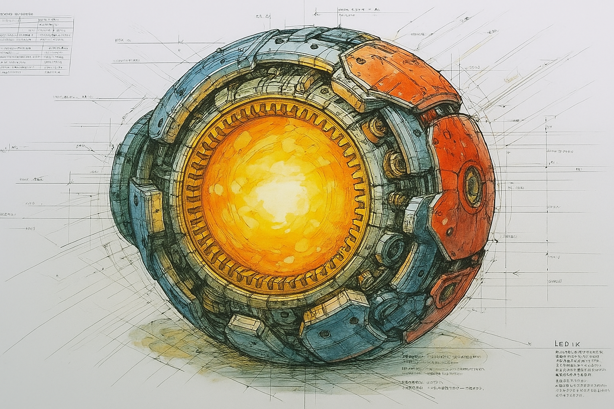

<link rel="preconnect" href="https://fonts.googleapis.com">
<link rel="preconnect" href="https://fonts.gstatic.com" crossorigin>
<link href="https://fonts.googleapis.com/css2?family=Doto&display=swap" rel="stylesheet">

  <em>Expanding the frontiers of artificial intelligence and the human mind. Building a future where human ingenuity is amplified by computational leverage.</em>
  
  {width=500}

coRE Truths

1. AI can perform a near-universal range of cognitive tasks when properly guided. Humanity's role is evolving from task execution to intent direction. The power to clearly communicate desired outcomes to AI is the new cornerstone of human agency.
2. A single human commands unprecedented cognitive leverage. The bottleneck is no longer access to knowledge, but the capacity to direct its application. Skillful execution of this direction is the new measure of impact.
3. Computational power is nearly infinite and AI access is a commodity. Therefore, the only scarce resource is human bandwidth—our finite capacity to ask questions, recognize quality, and direct the leverage. The dynamic of this interaction is where all value is now created.
4. The art of problem decomposition and prompt composition is the keystone of effective AI guidance. It is the craft of translating a grand vision into a series of achievable, computational steps.
5. In an age of infinite creation, curation becomes the highest form of creativity. The ability to recognize novel excellence and assemble disparate outputs into a coherent, valuable whole is the ultimate expression of human taste and vision.
6. Alignment is a function of informational clarity. Therefore, our pursuit of Artificial General Intelligence is inseparable from the pursuit of a foundational, unbiased understanding of reality. An Absolute Knowledge-base for the universe.

